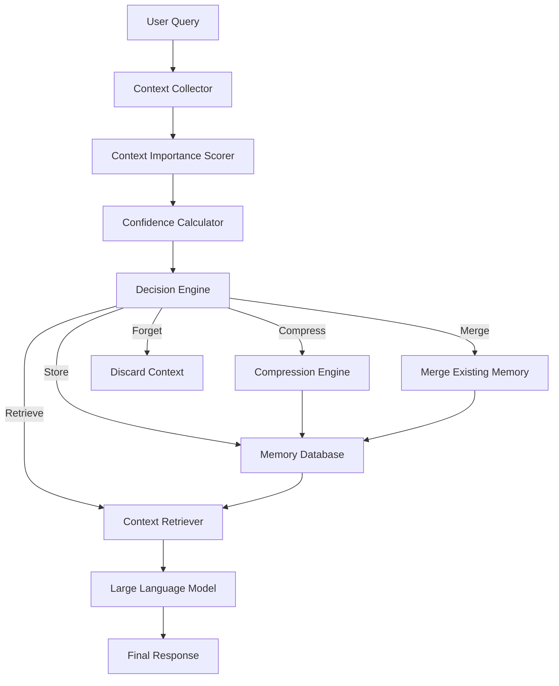
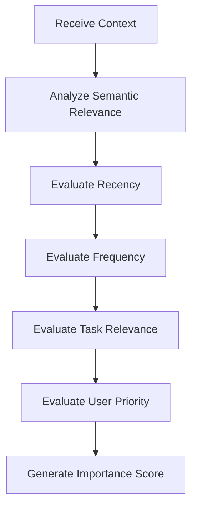
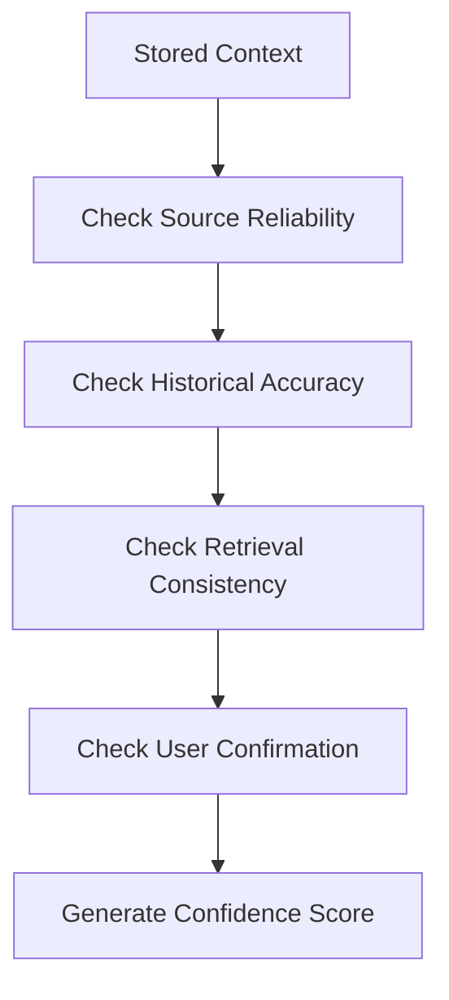
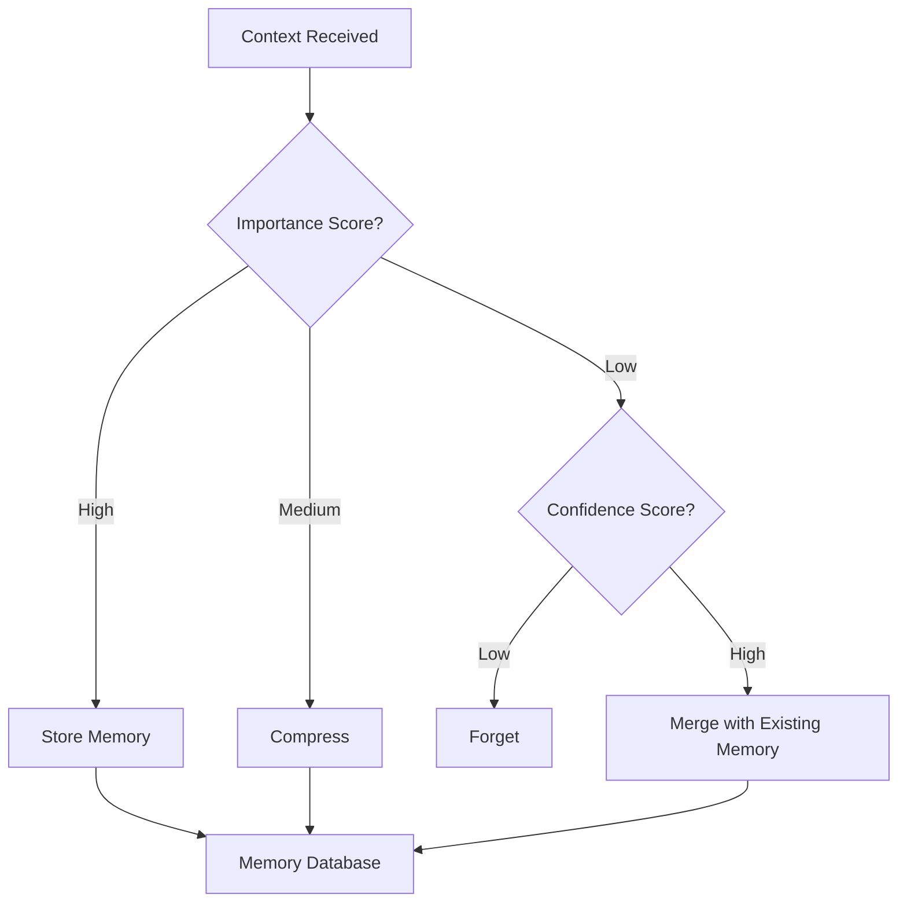
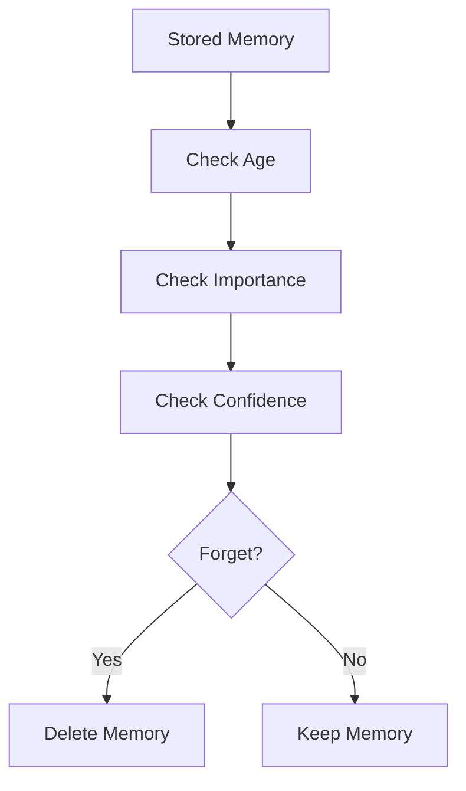
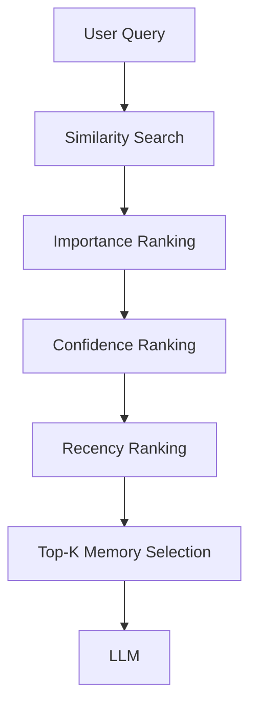
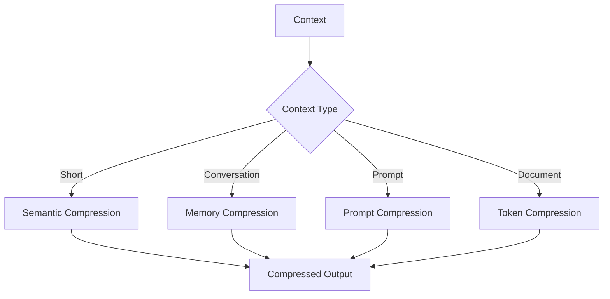

# Flowcharts

# Adaptive Context Intelligence Engine (ACIE)

---

# Flowchart 1: Overall ACIE Workflow

---

# Flowchart 2: Context Importance Scoring

---

# Flowchart 3: Confidence Score Calculation

---

# Flowchart 4: Decision Engine

---

# Flowchart 5: Adaptive Forgetting

---

# Flowchart 6: Memory Retrieval

---

# Flowchart 7: Compression Strategy Selection

---

# Summary

These flowcharts illustrate the complete processing pipeline of the Adaptive Context Intelligence Engine (ACIE), including context evaluation, adaptive decision-making, memory management, retrieval, and compression strategy selection. They provide a high-level visual representation of the system architecture and support the algorithmic descriptions presented in the accompanying documentation.
